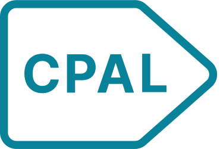

# cpaltemplates 

<!-- badges: start -->
[](https://github.com/childpovertyactionlab/cpaltemplates)
[](https://github.com/childpovertyactionlab/cpaltemplates/actions)
[](https://www.gnu.org/licenses/gpl-3.0)
<!-- badges: end -->

## Overview

**cpaltemplates** is a comprehensive R package that provides templates, themes, and utilities for standardizing data visualizations and analyses at the Child Poverty Action Lab. This package ensures consistent branding, accessibility, and quality across all CPAL data products.

## Installation

You can install most recent stable version of cpaltemplates from GitHub:

```r
# install.packages("devtools")
devtools::install_github("childpovertyactionlab/cpaltemplates")
```

## Features

### 🎨 Visualization System

#### **Themes**
Professional ggplot2 themes aligned with CPAL brand guidelines:

```r
library(cpaltemplates)
library(ggplot2)

# Apply CPAL theme to any ggplot
ggplot(mtcars, aes(mpg, wt)) +
  geom_point() +
  theme_cpal()  # Default CPAL theme

# Available theme variants
theme_cpal_classic()   # Traditional academic style
theme_cpal_minimal()   # Clean, minimal design
theme_cpal_dark()      # Dark mode for presentations
theme_cpal_map()       # Optimized for maps
theme_cpal_print()     # Print-ready formatting
```

#### **Color System**
Comprehensive color palettes with accessibility built-in:

```r
# Access CPAL colors
cpal_colors()          # Core brand colors
cpal_colors_primary()  # Primary palette
cpal_colors_extended() # Extended palette

# Apply color scales to plots
ggplot(diamonds, aes(cut, fill = color)) +
  geom_bar() +
  scale_fill_cpal() +   # Discrete colors
  theme_cpal()

# Continuous color scales
ggplot(faithfuld, aes(waiting, eruptions, fill = density)) +
  geom_tile() +
  scale_fill_cpal_c() + # Continuous colors
  theme_cpal()

# View available palettes
view_cpal_palettes()
list_cpal_palettes()
```

### 📊 Interactive Visualizations

Transform static plots into interactive visualizations:

```r
# Create interactive plot
p <- ggplot(mtcars, aes(mpg, wt, color = factor(cyl))) +
  geom_point() +
  theme_cpal()

# Make it interactive with tooltips
cpal_interactive(p, 
  tooltip_vars = c("mpg", "wt", "cyl"),
  hover_effect = TRUE
)

# Interactive geometric layers
cpal_point_interactive(aes(tooltip = paste("MPG:", mpg)))
cpal_line_interactive(aes(tooltip = paste("Value:", value)))
cpal_col_interactive(aes(tooltip = paste("Count:", n)))
```

### 🗺️ Mapping Support

Create interactive maps with CPAL styling:

```r
# Initialize a CPAL-styled map
map <- cpal_mapgl(
  center = c(-96.7970, 32.7767),  # Dallas coordinates
  zoom = 10,
  style = "light"  # or "dark", "satellite"
)

# Add data layers
map %>%
  cpal_mapgl_layer(
    data = your_geojson,
    type = "fill",
    fillColor = cpal_colors()["teal"],
    fillOpacity = 0.7
  )
```

### 📋 Table Formatting

Create publication-ready tables with CPAL styling:

```r
# GT tables with CPAL theme
cpal_table_gt(mtcars,
  title = "Motor Trend Car Data",
  subtitle = "1974 Motor Trend US magazine",
  highlight_columns = c("mpg", "hp")
)

# Interactive Reactable tables
cpal_table_reactable(mtcars,
  searchable = TRUE,
  sortable = TRUE,
  pagination = TRUE,
  highlight_row_on_hover = TRUE
)

# Simplified wrapper
cpal_table(mtcars, 
  type = "gt",        # or "reactable"
  title = "My Table"
)
```

### 🚀 Project Templates

Quickly scaffold new projects with CPAL standards:

```r
# Create a new analysis project
start_project(
  name = "quarterly-analysis",
  type = "analysis",
  include_git = TRUE,
  include_renv = TRUE
)

# Create a Shiny dashboard
start_project(
  name = "data-dashboard",
  type = "shiny_dashboard"
)

# Available project types:
# - "basic": Simple R project
# - "analysis": Data analysis with targets
# - "report": Quarto report template
# - "shiny_app": Basic Shiny application
# - "shiny_dashboard": Full dashboard
# - "package": R package structure
```

### 📝 Quarto Templates

Generate professional reports and presentations:

```r
# Create a CPAL report
use_quarto_report(
  title = "Quarterly Report",
  author = "Your Name",
  path = "reports/"
)

# Create presentation slides
use_quarto_slides(
  title = "Data Insights",
  path = "presentations/"
)

# Create a web document
use_quarto_web(
  title = "Interactive Analysis",
  path = "web/"
)
```

### 🎯 Targets Workflow

**STILL UNDER CONSTRUCTION**
Set up reproducible analysis pipelines:

```r
# Add targets to existing project
use_targets(
  type = "analysis",  # or "etl", "modeling"
  path = "."
)
```

### 🔧 Utilities

#### **Font Management**
```r
# Setup Google Fonts for consistency
setup_cpal_google_fonts()

# Get appropriate font family
get_cpal_font_family(for_interactive = FALSE)
```

#### **Plot Export**
```r
# Save plots with consistent settings
save_cpal_plot(
  plot = my_plot,
  filename = "analysis.png",
  width = 10,
  height = 6,
  dpi = 300
)
```

#### **Logo Integration**
```r
# Add CPAL logo to plots
my_plot + add_cpal_logo(position = "bottom-right")
```

#### **Accessibility Checking**
```r
# Check if colors meet WCAG standards
check_plot_accessibility(my_plot)
```

#### **Asset Management**
```r
# Update package assets
update_cpal_assets()

# Get specific assets
get_cpal_asset("logo", category = "logos")
```

## Quick Start Guide

### 1. Basic Visualization

```r
library(cpaltemplates)
library(ggplot2)
library(dplyr)

# Set up fonts (run once per session)
setup_cpal_google_fonts()

# Create a simple bar chart
mtcars %>%
  group_by(cyl) %>%
  summarise(avg_mpg = mean(mpg)) %>%
  ggplot(aes(factor(cyl), avg_mpg, fill = factor(cyl))) +
  geom_col() +
  scale_fill_cpal() +
  theme_cpal() +
  labs(
    title = "Average MPG by Cylinder Count",
    subtitle = "Motor Trend Car Road Tests",
    x = "Cylinders",
    y = "Miles per Gallon",
    fill = "Cylinders"
  )
```

### 2. Interactive Dashboard

```r
# Create a new dashboard project
start_project("my-dashboard", type = "shiny_dashboard")

# This creates a complete dashboard structure with:
# - app.R with CPAL theming
# - modular structure
# - CPAL color scheme
# - Responsive layout
```

### 3. Professional Report

```r
# Create a report project
use_quarto_report(
  title = "Annual Data Report",
  author = "CPAL Data Team"
)

# This generates:
# - Quarto document with CPAL styling
# - Bibliography support
# - Professional formatting
# - Export to PDF/HTML/Word
```

## Package Components

### Core Functions by Category

| Category | Key Functions | Description |
|----------|--------------|-------------|
| **Themes** | `theme_cpal()`, `theme_cpal_*()` | ggplot2 themes for consistent styling |
| **Colors** | `scale_*_cpal()`, `cpal_colors()` | Color palettes and scales |
| **Interactive** | `cpal_interactive()`, `cpal_*_interactive()` | Interactive visualizations |
| **Tables** | `cpal_table_gt()`, `cpal_table_reactable()` | Formatted tables |
| **Dashboards** | `cpal_shiny()` | Shiny dashboard components |
| **Projects** | `start_project()`, `use_*()` | Project scaffolding |
| **Maps** | `cpal_mapgl()`, `cpal_mapgl_layer()` | Interactive mapping |
| **Utilities** | `save_cpal_plot()`, `add_cpal_logo()` | Helper functions |

## Best Practices

### Visualization Guidelines

1. **Always use CPAL themes** for consistency
2. **Check accessibility** with `check_plot_accessibility()`
3. **Use semantic color mappings** from CPAL palettes
4. **Include descriptive titles and subtitles**
5. **Export at 300 DPI** for print materials

### Project Organization

1. **Use project templates** to maintain structure
2. **Implement targets** for reproducible workflows
3. **Version control** with git (included in templates)
4. **Document dependencies** with renv

### Performance Tips

1. **Cache interactive plots** when working with large datasets
2. **Use appropriate table type** (GT for static, Reactable for interactive)
3. **Optimize map layers** by simplifying geometries when needed

## Requirements

- R ≥ 4.3.0
- Core dependencies: ggplot2, gt, reactable, bslib, sass
- Optional: quarto (for reports), shiny (for apps), targets (for pipelines)

## Contributing

We welcome contributions! Please see our [Contributing Guidelines](CONTRIBUTING.md) for details.

### Development Setup

```r
# Clone the repository
git clone https://github.com/childpovertyactionlab/cpaltemplates.git

# Install development dependencies
devtools::install_deps(dependencies = TRUE)

# Run checks
devtools::check()
```

## Support

- **Documentation**: Full function documentation available via `?function_name`
- **Issues**: [GitHub Issues](https://github.com/childpovertyactionlab/cpaltemplates/issues)
- **Email**: datalab@childpovertyactionlab.org

## License

GPL-3 © Child Poverty Action Lab

## Acknowledgments

This package was developed by the Child Poverty Action Lab data team to standardize and improve data visualization practices across the organization.

---

*For more examples and detailed documentation, visit the [package website](https://github.com/childpovertyactionlab/cpaltemplates).*
